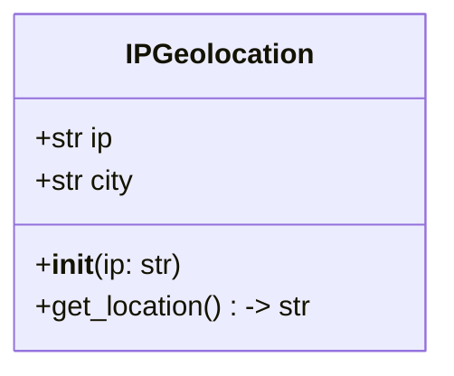
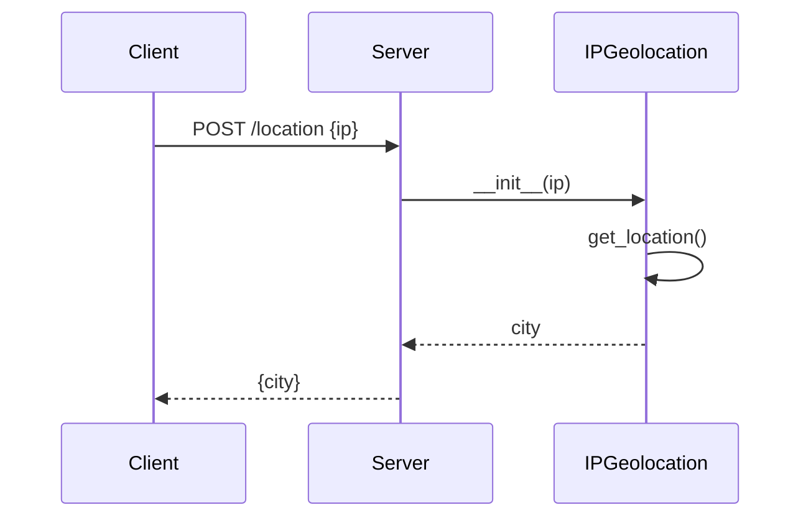

## Implementation approach
To implement this system, we will use Flask, a lightweight and popular web framework for Python. Flask is open-source and provides a lot of flexibility and control over the API endpoints. For the IP geolocation, we will use the 'ip2geotools' library, an open-source Python library that provides several services to convert an IP into a geographical location. 

The system will have a single endpoint that accepts POST requests with an IP address in the request body. It will then use the 'ip2geotools' library to fetch the location of the IP address and return it in the response.

The README will be written in Markdown and will provide a step-by-step guide on how to set up the project, start the server, and make requests to the API.

## Python package name
```python
"ip_location_api"
```

## File list
```python
[
    "main.py",
    "requirements.txt",
    "README.md"
]
```

## Data structures and interface definitions


## Program call flow


## Anything UNCLEAR
The requirement is clear. The only potential challenge is handling various edge cases, such as invalid IP addresses or issues with the 'ip2geotools' library. However, these can be handled with proper error handling and validation.